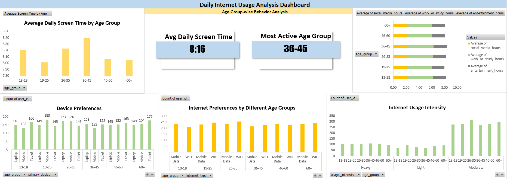
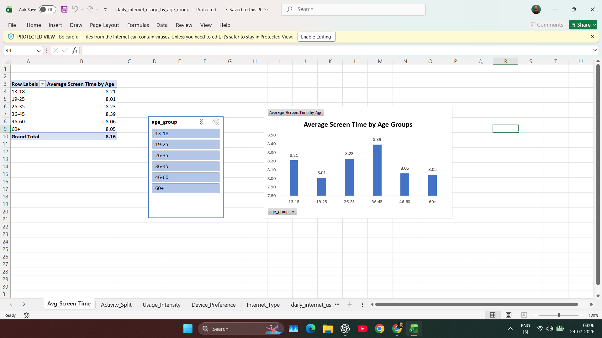
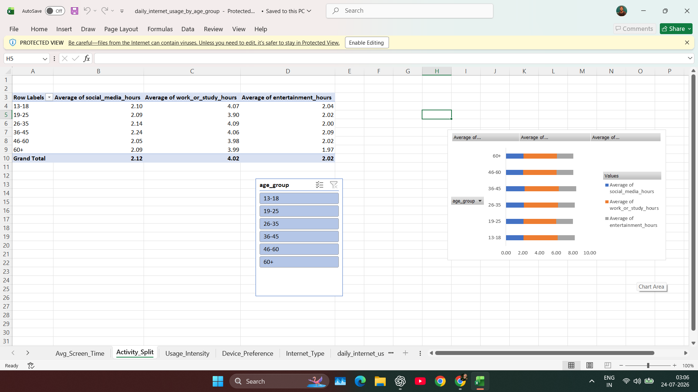
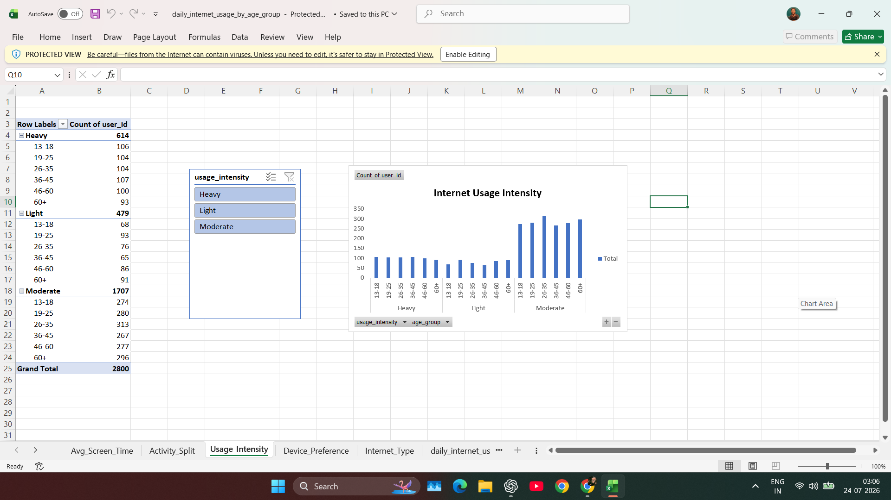
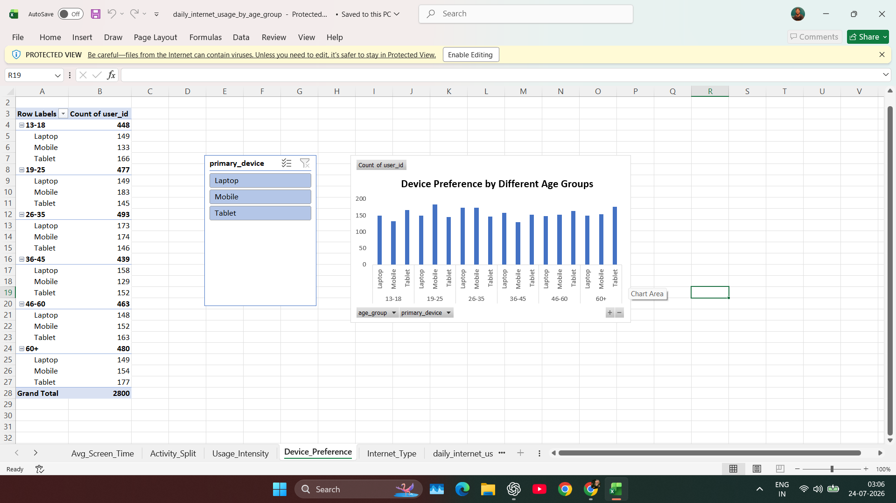
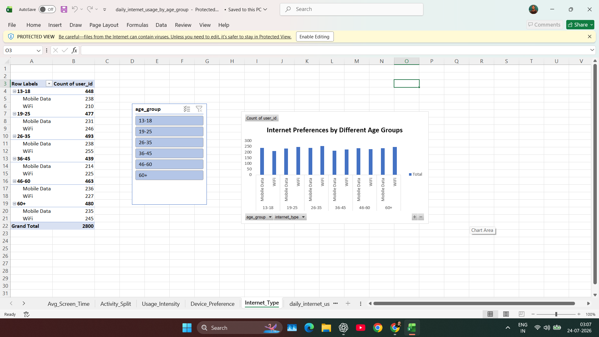
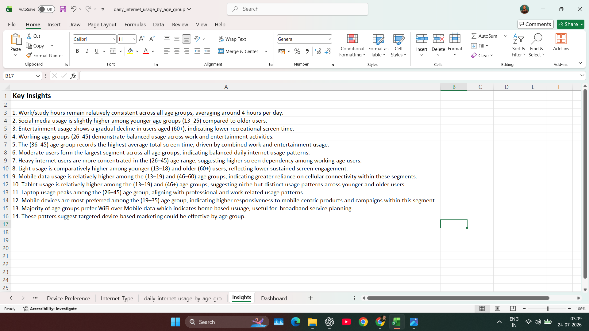

# 📊 Daily Internet Usage Analysis Dashboard using Microsoft Excel

## 📌 Project Overview

This project presents an interactive Microsoft Excel dashboard analyzing daily internet usage behavior across different age groups.

The objective of the analysis is to understand how internet usage patterns vary by age based on screen time, internet usage intensity, preferred devices, internet connectivity, work/study hours, social media usage, and entertainment activities.

The project demonstrates the complete data analysis workflow including data cleaning, validation, transformation, data modeling, visualization, and business insight generation using Microsoft Excel.

---

# 📂 Repository Structure

```text
Daily-Internet-Usage-Analysis/
│
├── Dashboard/
│   └── daily_internet_usage_by_age_group.xlsx
│
├── Dataset/
│   └── daily_internet_usage_by_age_group.csv
│
├── Documentation/
│   └── Daily Internet Usage by Age Groups text.docx
│
├── Images/
│   ├── Activity-Split-by-Age-Groups.png
│   ├── Avg-Screen-Time-by-Age-Groups.png
│   ├── daily_internet_usage_by_different_age_groups.png
│   ├── Device-Preference-by-Age-Groups.png
│   ├── Internet-Preference-by-Age-Groups.png
│   ├── Internet-Usage-Intensity-by-Age-Groups.png
│   └── Key-Business-Insights.png
│
├── Presentation/
│   ├── Daily Internet Usage Analysis by Age Groups.pdf
│   └── Daily Internet Usage Analysis by Age Groups.pptx
│
├── Videos/
│   └── Daily-Internet-Usage-Dashboard-Walkthrough.mp4
│
└── README.md
```

---

# 📊 Dashboard Preview

## Complete Dashboard



---

# 🎯 Business Objectives

This dashboard answers several business questions, including:

- Which age group records the highest average daily screen time?
- How does internet activity differ across age groups?
- Which internet usage intensity category is most common?
- Which devices are preferred by different age groups?
- Which internet connection (WiFi or Mobile Data) is preferred?
- How do social media, work/study, and entertainment hours compare?
- What business insights can help digital marketers and service providers?

---

# 📈 Dashboard Components

## 📌 Average Daily Screen Time

Analyzes the average daily screen time across different age groups.

**Insights**

- Identifies the most active age group.
- Compares screen time patterns across all users.

---

## 📌 Activity Split Analysis

Compares average daily hours spent on:

- Social Media
- Work / Study
- Entertainment

across all age groups.

---

## 📌 Internet Usage Intensity

Categorizes users into:

- Heavy Users
- Moderate Users
- Light Users

to understand internet engagement patterns.

---

## 📌 Device Preference Analysis

Analyzes preferred devices among users:

- Mobile
- Laptop
- Tablet

segmented by age group.

---

## 📌 Internet Connectivity Preference

Compares preferred internet connection type:

- WiFi
- Mobile Data

across different age groups.

---

## 📌 KPI Cards

The dashboard includes dynamic KPI cards highlighting:

- Average Daily Screen Time
- Most Active Age Group

---

# 📊 Interactive Features

The dashboard is fully interactive using Excel Slicers.

Users can dynamically filter the dashboard by:

- Age Group
- Usage Intensity
- Device Type
- Internet Type

All Pivot Charts automatically update based on slicer selections.

---

# 🛠 Data Preparation

The dataset was prepared using Microsoft Excel.

The workflow included:

- Data Cleaning
- Duplicate Checking
- Missing Value Handling
- Data Validation
- Data Formatting
- Data Transformation
- Creating Calculated Columns
- Data Categorization
- Excel Tables
- Data Modeling

Derived columns include:

- Age Group
- Total Screen Time
- Usage Intensity

---

# 📊 Dashboard Visuals

## Average Screen Time



---

## Activity Split



---

## Internet Usage Intensity



---

## Device Preference



---

## Internet Preference



---

## Business Insights



---

# 🎥 Dashboard Walkthrough

The repository includes a short dashboard walkthrough demonstrating:

- Interactive slicers
- Dynamic filtering
- Dashboard navigation
- KPI updates
- Business insights

**Video**

```text
Videos/Daily-Internet-Usage-Dashboard-Walkthrough.mp4
```

---

# 📊 Excel Features Used

- Microsoft Excel
- Excel Tables
- Pivot Tables
- Pivot Charts
- Slicers
- Conditional Formatting
- Data Validation
- Sorting & Filtering
- Lookup Functions
- Logical Functions
- Statistical Functions
- Calculated Columns
- Dashboard Design

---

# 💡 Key Business Insights

- The **36–45** age group records the highest average daily screen time.
- Work and study hours remain relatively consistent across all age groups.
- Moderate internet users represent the largest user segment.
- Heavy internet usage is more concentrated among working-age users.
- Younger users spend comparatively more time on social media.
- WiFi is the preferred internet connection across most age groups.
- Mobile devices remain the most commonly preferred device among younger users.
- Device and internet preferences vary across age groups, enabling targeted digital strategies.

---

# 🧰 Tools & Technologies

- Microsoft Excel
- Pivot Tables
- Pivot Charts
- Excel Tables
- Slicers
- Conditional Formatting
- Data Validation
- Dashboard Design

---

# 📁 Dataset

The dataset contains information such as:

- User ID
- Date
- Age
- Age Group
- Social Media Hours
- Work / Study Hours
- Entertainment Hours
- Total Screen Time
- Usage Intensity
- Primary Device
- Internet Type

---

# 📄 Additional Project Resources

The repository also includes:

- 📄 Project Documentation (.docx)
- 📑 Project Presentation (.pptx)
- 📕 Presentation PDF
- 🎥 Dashboard Walkthrough Video

---

# 🚀 Learning Outcomes

Through this project, I strengthened my skills in:

- Data Cleaning & Validation
- Data Transformation
- Excel Data Modeling
- Pivot Table Analysis
- Interactive Dashboard Design
- Business Analysis
- Data Visualization
- Insight Generation
- Reporting & Presentation

---

# 🚀 Future Improvements

- Rebuild the dashboard in Power BI.
- Connect SQL for dynamic reporting.
- Automate data refresh using Power Query.
- Add advanced KPI cards and interactive charts.
- Perform predictive analysis using Python.

---

# 👨‍💻 Author

**Milan Kumar**

If you found this project helpful or have any suggestions, feel free to connect or provide feedback.